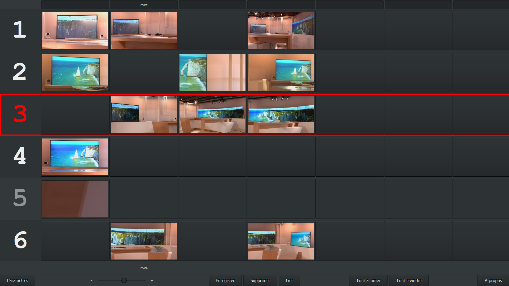

# PTZ Memory (pan/tilt/zoom/focus memories) for Panasonic PTZ cameras (AW-HE130, AW-UE150, AW-UE160, ...)

## Settings :

## Usefull key binds :
Alt + Q : Quit.

Alt + F : Swich between fullscreen and windowed modes.

Fn : Open control window of camera n.

Echap : Close child window (camera control window, settings window, ...).

Alt + C : Retrieve jpeg picture (quality n°1) from the selected camera (control window opened) or from all cameras.

Right click on thumbnail : Allow you to name it.

## Miscellaneous :
The settings, memories and thumbnails are stored in the file « PTZ-Memory.dat ».

When an error is detected by a camera (motor, sensor, fan, ..), a colored area (with a tooltip) appear beside the number of camera.

Files in the folder « resources » define the layout of the software.

